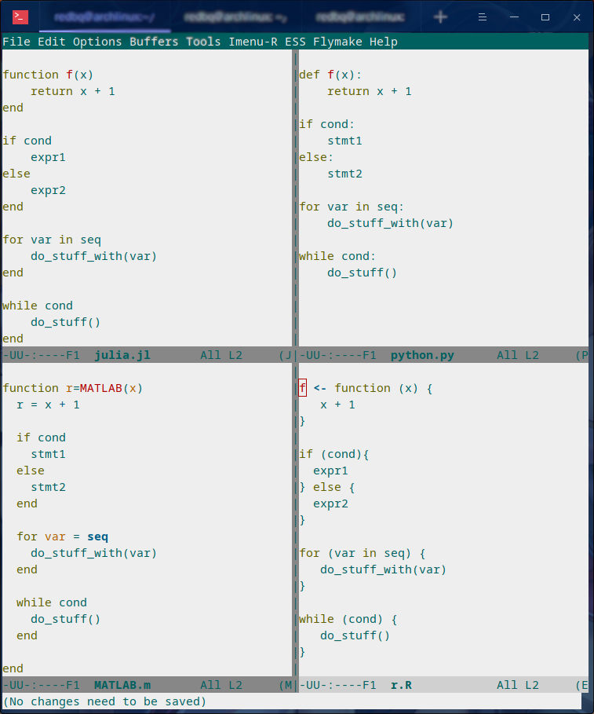

# 高观点下的Julia范用编程

[Julia](https://julialang.org)是一个支持可选类型标注的纯动态多范式语言。

由于其引入的一些像For循环，While循环, If循环, 函数等的基本语言构造, 与Python, R或是MATLAB类似,
Julia变得简单和简洁, 使得你可以仅用它一部分的语言特性便流畅地工作。



尽管人们很少关注Julia除开高性能以外的语言特性(截止2019年4月)，我的角度却是在它的范用编程方面。

## First-Class

Julia中, 几乎所有的语言构造都是**first-class**的，使得语言的灵活性和可组合性得以彰显。

很多人对于Python缺少多行lambda这事抱有偏见。尽管把多行lambda编译到通常的Python code object是相当平凡和直接的,
前端，更具体点，强制缩进，通过严格分离表达式和语句(语句无法出现在表达式中), 限制了Python的表达力, 也失去了
first-class。其他的没有限制expression-first的语言缩进方式是有的，例如ML家族和Haskell, 但还没有被Python社区所采纳。

Julia看起来有点过于first-class, 因为它所有的构造都是表达式, 在语法上讲并不限制任意语言构造的组合。**定义**和**计算**在很多主流的函数式语言中是分离的，只是两者的组成里各自包含对方。

```julia
[let y=f(x); (x, y) end for x in points]
map(
    function map_fn(x)
        # 做一些事情
    end,
    points
)

let bind_maybe(a, f) -> a == nothing ? f(a) : nothing,
    (|>) = bind_maybe

    init          |> a ->
    do1_stuffs(a) |> a ->
    ...           |> a ->
    ...           |> a ->
    ...
end
```


为什么可组合性很关键的原因多年来被经常讨论，所以我不会就此再整一个。
对于Julia而言，first-class在涉及**代码及数据**时会很有用, 文章稍后展开这点。

##　多重分派的多态

Julia支持多态，以实现必要的抽象，减少self-repeating，尽管和那些流行的工业语言有着明显的不同。

多重分派看起来有点像参数化多态, 但实际上其含义比起后者要多。

```julia
   function usum(x :: Vector{T}) where T
      s = zero(T)
      for each in x
         s += each
      end
      s
   end
```

重载也是可以的。

```julia
   uzero(_ :: Type{Int})     = 0
   uzero(  :: Type{Float64}) = 0.0
```

然而多重分派不仅仅是我上面列举的。实际上类型只是可分派的不可变数据的一种特殊实例，
你能够用不可变的数据来分派，不管它是类型还是别的什么劳什子。

```julia

   struct Const{T}
   end

   flip(::Type{Const{:even}}) = Const{:odd}
   flip(::Type{Const{:odd}})  = Const{:even}

   f(::Type{Const{0}}) = Const{:even}
   f(::Type{Const{1}}) = Const{:odd}
   f(::Type{Const{N}}) where N = f(Const{N-1}) |> flip

```

使用上述代码，我们可以如期地静态计算数字的奇偶性。

```julia
   julia> @code_warntype f(Const{2})

   Body::Type{Const{:even}}
     1 ─     return Const{:even}
```

注意，如果多重分派在静态推断上失败，它将表现得如同Python中的动态分派一般。

## Full-Featured的宏

宏是实现代码复用的极少途径之一, 也是为什么有一些程序员千百倍高效于其他人的原因。

```julia

  julia> macro gen_var(n :: Int, f)
         defs = [Expr(:(=), Symbol("var", i), :($f($i)))  for i in 1:n]
         esc(Expr(:block,  defs..., nothing))
       end

  @gen_var (macro with 1 method)

  julia> f(x) = x * 10 - 2
  f (generic function with 1 method)

  julia> @gen_var f (x * 10 - 2)

  julia> var1
  8

  julia> var2
  18
```

## 宏，从AST到AST的函数

一旦你知道宏是从AST到AST的函数后，Julia的宏便不再神秘。

```julia
   macro f(x)
     println(x)
     :($x + 1)
   end

   @assert (@f 1) == 2
```

上述代码展示了Julia宏的一个生动例子。首先 `macro` 关键字引导宏变换规则的定义，而`@f`标记来对应宏规则的调用点。

你可能会问为什么`(@f 1 == 2`, 因为宏`@f`的返回值是一个AST，看起来让它和整数`2`相等有点魔幻。

认真看`@assert (@f 1) == 2`。由于宏调用是从内到外依次处理的，我们首先处理的应该是`@f 1`。

```julia
  (function f(x)
      println(x)
     :($x + 1)         =>  :(1 + 1)
  end)(1)
```

上面这步，在执行AST到AST的函数`f`, 即宏`@f`, 的时候，还会写stdio.

随后，由于我们已经拿到一个输出, AST `:(1 + 1)`, 设想我们用它置换先前代码中的`@f 1`，这会产生一个`@assert $(:(1 + 1)) == 2`,
化简它，然后我们得到`@assert (1 + 1) == 2`。

你可能会问为什么`@assert :(1 + 1) == 2`, 好问题，我们深入研究一个。

想想如果你从宏调用处返回的是一个运行时AST，它不会被转换为要编译的代码，以至于这样的宏会变得完全没有用。

如果我们*unquote*宏的返回，


